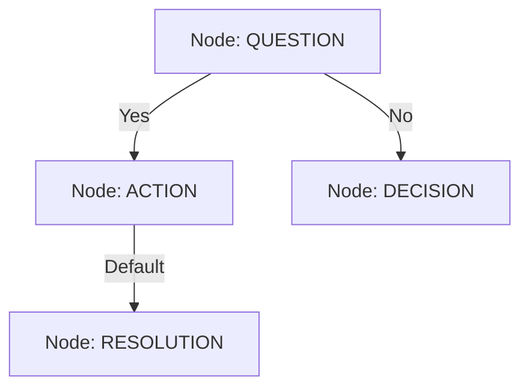

# Troubleshooting System - Technical Explanation

This document provides a comprehensive overview of the troubleshooting assistant's architecture, data flow, and handling of edge cases.

## System Overview

The system is a two-part engine designed to digitize and execute troubleshooting procedures:

1.  **Ingestion Engine**: Converts unstructured documents (PDFs/URLs) into structured, type-safe decision graphs.
2.  **Execution Engine**: Interactive chat interface that traverses these graphs to guide users to resolutions without hallucinating.

## Architecture & Data Flow

### 1. Ingestion Flow (Extraction)

`Document` → `Text Parsing` → `LLM Extraction` → `Schema Validation` → `JSON Storage`

1.  **Source Input**: User provides a PDF path or URL.
2.  **Parsing**: `extract.ts` uses `pdfjs-dist` for PDFs or `fetch` + regex for URLs to get raw text.
3.  **LLM Processing**: The text is sent to Gemini with a system prompt (`EXTRACTION_SYSTEM_PROMPT`) enforcing a strict node-based JSON structure.
4.  **Validation**: The output is parsed and validated against Zod schemas (`TroubleshootingProcessSchema`).
    - _Self-Correction_: If the LLM returns broken JSON (Markdown blocks, truncated output), `repairJson()` attempts to fix syntax errors before parsing.
5.  **Storage**: Valid processes are saved as individual JSON files in `data/processes/`.

### 2. Execution Flow (Interactive Chat)

`User Query` → `Registry Search` → `Context assembly` → `LLM Tool Usage` → `Graph Traversal` → `Response`

1.  **Initialization**: `main.ts` loads all JSON files from `data/processes/` into the in-memory `ProcessRegistry`.
2.  **User Loop**:
    - User asks a question.
    - The LLM (`llm-client.ts`) analyzes the query using the `CHAT_SYSTEM_PROMPT`.
3.  **Tool Execution**:
    - **Search**: The LLM calls `searchProcesses` to find relevant workflows.
    - **Retrieval**: Once a process is selected, it calls `getProcessDetails` to load the full graph.
4.  **Graph Traversal**: The LLM acts as an iterator, reading the current node (Question/Action), waiting for user input, and following the `next` pointer logic defined in the JSON.
5.  **Resolution**: The conversation ends when a "resolution" node is reached or the user exits.

## Process Selection Mechanism

A key question is how the LLM knows **which** JSON file to use among potentially hundreds of files. It does **not** iterate through files itself. Instead, the system uses an **In-Memory Index** pattern.

1.  **Startup Loading**: When `bun chat` starts, `registry.ts` iterates through the `data/processes/` directory. It reads **every** JSON file once and loads them into a fast in-memory `Map<ProcessId, ProcessData>`.
2.  **No Vector DB**: Currently, there is no vector database or external search engine. The index is purely in RAM.
3.  **Search Tool (`searchProcesses`)**:
    - When the user asks "How do I fix a paper jam?", the LLM calls the `searchProcesses` tool with keywords like `"paper jam"`.
    - The compiled `registry.ts` code performs a **linear scan** of the in-memory Map.
    - It checks if the keywords exist in:
      - `processName`
      - `description`
      - `tags`
      - `entryCriteria`
    - It returns a list of **Process Summaries** (ID + Name + Description) to the LLM.
4.  **Selection**: The LLM sees this short list of candidates. It then "decides" which ID is the best match and calls `getProcessDetails(selectedId)` to get the full graph for that specific process only.

## Scalability & Performance

**Current Limit**: The current "In-Memory Registry" is designed for hundreds, not thousands, of files. If you load **20,000 JSON files**, the system would likely crash or become unusable.

### Why the Current Approach Hits Limits:

1.  **Memory Overhead (RAM)**: Loading 20,000 large JSON objects into the Node.js heap would exceed the default memory limits (typically ~2GB), causing an `Out of Memory` crash.
2.  **Startup Latency**: Physically reading and parsing 20k files from the disk at startup would take significant time (10-30+ seconds).
3.  **Search Latency**: A linear search ($O(N)$) through 20k items for every single chat interaction is too slow for a real-time experience.

### The "Better Way" (Production Architecture)

To scale to 20k, 100k, or millions of processes, we would move to a **RAG (Retrieval-Augmented Generation)** architecture or a **Database-backed** approach.

| Feature      | Current (POC)                  | Scalable (Production)                                                            |
| :----------- | :----------------------------- | :------------------------------------------------------------------------------- |
| **Storage**  | Local File System (JSON)       | **Vector Database** (e.g., Pinecone, pgvector) or **SQL DB** (SQLite/PostgreSQL) |
| **Loading**  | Load **ALL** into RAM at start | **Lazy Loading**: Only fetch metadata first; load full graph only when needed    |
| **Search**   | Keyword Match (Regex)          | **Semantic Search** (Embeddings) or **Full-Text Search (FTS)**                   |
| **Indexing** | In-Memory Map                  | **ANN Index** (Approximate Nearest Neighbor) or SQL Index                        |

#### Recommended Hybrid Approach for 20k Files:

1.  **SQLite / DuckDB**: Store the metadata (ID, Name, Description, Tags) in a local SQL database.
2.  **Full-Text Search (FTS)**: Use SQLite's FTS5 engine for instant keyword search ($O(\log N)$).
3.  **Lazy Graph Fetch**: Keep the heavy JSON graphs on disk (or in a `JSONB` column). Only load the _specific_ graph node-set into memory _after_ the user selects a process.

This ensures:

- **Startup**: < 1 second (just open DB connection).
- **RAM**: Minimal (only active conversation context).
- **Search**: < 10ms.

## Core Data Structure: Node-Based Graph

Unlike simple linear lists, we use a directed graph model to handle complex logic.



- **Nodes**: The atomic units of a process.
- **Types**: `question` (branching), `action` (linear), `decision` (conditional logic), `resolution` (end state).
- **Edges**: Defined in the `next` object map (e.g., `{ "yes": "node_2", "no": "node_3" }`).

## Edge Case Handling

The following table details how the system handles various edge cases and failure modes.

| Category       | Edge Case                | Expected Behavior / Handling                                                                                                   |
| :------------- | :----------------------- | :----------------------------------------------------------------------------------------------------------------------------- |
| **Extraction** | **PDF/Text too large**   | **Truncation**: Content is truncated to ~25k tokens (100k chars) to fit LLM context window. A warning is logged.               |
| **Extraction** | **LLM returns Markdown** | **Auto-Repair**: Regex strips markdown code blocks (```json) to extract pure JSON.                                             |
| **Extraction** | **JSON Syntax Error**    | **Auto-Repair**: `repairJson()` algorithm attempts to add missing braces `}`, `]`, or quotes `"` if the stream was cut off.    |
| **Extraction** | **Invalid Schema**       | **Rejection**: Zod validation fails. The process is strictly rejected and not saved to ensure runtime safety. Error is logged. |
| **Extraction** | **Zero Processes Found** | **Termination**: Script exits gracefully with a "No processes found" message.                                                  |
| **Registry**   | **Duplicate IDs**        | **Overwrite**: If a new extraction produces a `processId` that already exists, the old file is overwritten.                    |
| **Registry**   | **Corrupt JSON File**    | **Skip**: The registry logs a failure for that specific file but continues loading other valid files.                          |
| **Chat**       | **Ambiguous Query**      | **Clarification**: LLM uses `askClarification` tool to present max 2 options to the user before proceeding.                    |
| **Chat**       | **No Matching Process**  | **Fallback**: LLM informs the user it couldn't find a match and asks for more specific details or the exact error message.     |
| **Chat**       | **Context Limit**        | **Sliding Window**: Chat history keeps only the last 10 messages to prevent token overflow during long sessions.               |
| **Chat**       | **API Failure (Gemini)** | **Error Message**: The specific API error is caught and displayed. User is prompted to check their API key.                    |
| **Chat**       | **Hallucination Risk**   | **Constrained**: System prompt explicitly forbids generating steps not found in the loaded JSON variables.                     |
| **Tools**      | **Invalid `processId`**  | **Error Return**: The tool returns a descriptive error string and a list of _available_ IDs to help the LLM self-correct.      |

## Component Breakdown

- **`main.ts`**: The CLI entry point. Manages the REPL loop and user I/O.
- **`extract.ts`**: Script for document ingestion. Handles file reading and orchestration of the extraction pipeline.
- **`llm-client.ts`**: The AI brain. Contains System Prompts, JSON repair logic, and the Vercel AI SDK wrappers.
- **`registry.ts`**: The "Database". An in-memory store that indexes processes for fast fuzzy searching and retrieval.
- **`schemas.ts`**: The Law. Zod definitions that enforce the shape of data throughout the entire application.
- **`tools.ts`**: The Interface. Functions exposed to the LLM to allow it to "see" and "access" the registry data.
