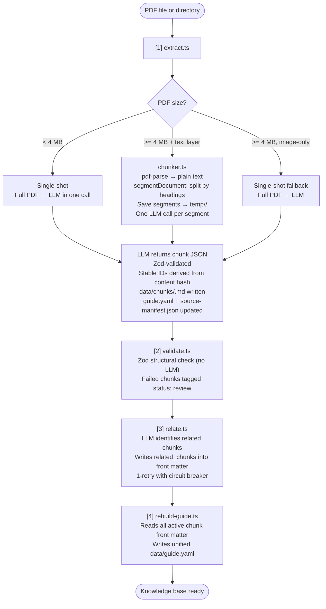
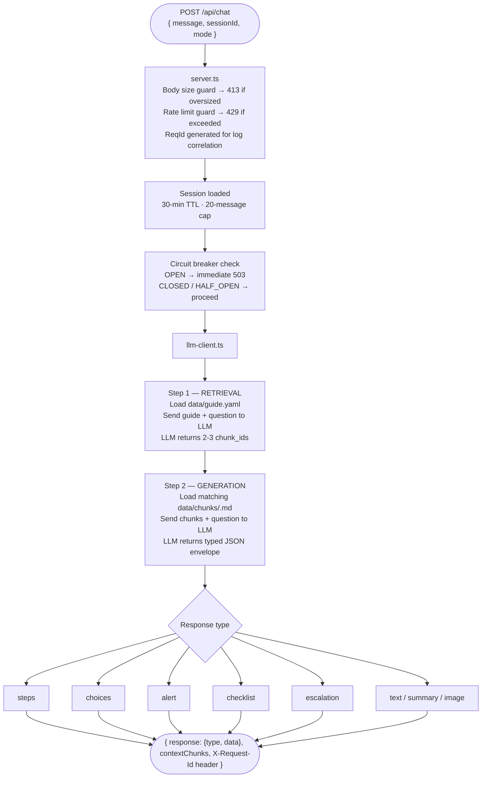

# HWL Troubleshooting Assistant — Guide

> An LLM-powered helpdesk assistant that answers support questions **strictly** from a structured, indexed knowledge base built from your own PDF documents. The AI cannot hallucinate — if the answer is not in a chunk, it escalates.

---

## Table of Contents

1. [Prerequisites](#1-prerequisites)
2. [Setup](#2-setup)
3. [Environment Variables](#3-environment-variables)
4. [How It Works](#4-how-it-works)
5. [Reliability & Production Behaviour](#5-reliability--production-behaviour)
6. [Scripts Reference](#6-scripts-reference)
7. [System Flow](#7-system-flow)
8. [API Reference](#8-api-reference)
9. [File Structure](#9-file-structure)

---

## 1. Prerequisites

| Requirement           | Version                                          |
| --------------------- | ------------------------------------------------ |
| [Bun](https://bun.sh) | `>= 1.0`                                         |
| LLM API Key           | Azure OpenAI / Google Gemini / Groq              |
| PDF documents         | Your source knowledge (user manuals, FAQs, SOPs) |

---

## 2. Setup

```bash
# 1. Copy environment template
cp .env.example .env

# 2. Edit .env — set AI_PROVIDER and the matching API key(s)

# 3. Install dependencies
bun install

# 4. Ingest your first PDF
bun run ingest ./your-manual.pdf

# 5. Start the API server
bun run server
# → http://localhost:3000

# 6. (Optional) Test via terminal chat
bun run chat
```

---

## 3. Environment Variables

All variables below are optional unless marked **required**. Defaults are listed — copy `.env.example` as your starting point.

### AI Provider (required — pick one)

| Variable                       | Description                                                              |
| ------------------------------ | ------------------------------------------------------------------------ |
| `AI_PROVIDER`                  | Active provider: `azure`, `google`, or `groq`. Auto-detected if omitted. |
| `AI_MODEL`                     | Override the model ID (e.g. `gpt-4o`). Uses provider default if omitted. |
| `GOOGLE_GENERATIVE_AI_API_KEY` | Google Gemini API key                                                    |
| `GROQ_API_KEY`                 | Groq API key                                                             |
| `AZURE_API_KEY`                | Azure OpenAI API key                                                     |
| `AZURE_OPENAI_ENDPOINT`        | Azure endpoint URL                                                       |
| `AZURE_OPENAI_DEPLOYMENT_NAME` | Model deployment name (e.g. `gpt-4o`)                                    |
| `AZURE_OPENAI_RESOURCE_NAME`   | Azure resource name                                                      |
| `AZURE_API_VERSION`            | API version (e.g. `2024-12-01-preview`)                                  |

### Paths

| Variable       | Default         | Description                                                                                                                                                |
| -------------- | --------------- | ---------------------------------------------------------------------------------------------------------------------------------------------------------- |
| `PROJECT_ROOT` | `process.cwd()` | Absolute path to the project root. Set this when starting the process from a different working directory (Docker, PM2, etc.). Example: `PROJECT_ROOT=/app` |

### HTTP Server

| Variable             | Default                 | Description                                                                                                  |
| -------------------- | ----------------------- | ------------------------------------------------------------------------------------------------------------ |
| `CORS_ORIGIN`        | `http://localhost:5173` | Allowed frontend origin. **Must be changed in production.**                                                  |
| `MAX_BODY_BYTES`     | `65536` (64 KB)         | Maximum accepted body size for `POST /api/chat`. Requests over this limit return `413`.                      |
| `REQUEST_TIMEOUT_MS` | `120000` (120 s)        | How long to wait for an LLM response before returning `504`. Prevents connections from hanging indefinitely. |

### Rate Limiting

| Variable               | Default        | Description                                                                                      |
| ---------------------- | -------------- | ------------------------------------------------------------------------------------------------ |
| `RATE_LIMIT_WINDOW_MS` | `60000` (60 s) | Sliding-window duration for the per-session request counter.                                     |
| `RATE_LIMIT_MAX`       | `20`           | Maximum requests per session within the window. Returns `429` with `retryAfterMs` when exceeded. |

### Circuit Breaker

| Variable                    | Default        | Description                                                                     |
| --------------------------- | -------------- | ------------------------------------------------------------------------------- |
| `CIRCUIT_BREAKER_THRESHOLD` | `5`            | Number of consecutive LLM failures before the breaker opens (fail-fast mode).   |
| `CIRCUIT_BREAKER_RESET_MS`  | `60000` (60 s) | How long the breaker stays open before allowing a single probe request through. |

### Logging

| Variable    | Default | Description                                                                                          |
| ----------- | ------- | ---------------------------------------------------------------------------------------------------- |
| `LOG_LEVEL` | `info`  | Winston log level: `error` \| `warn` \| `info` \| `debug`. Set `warn` in production to reduce noise. |

---

## 4. How It Works

The system operates in two distinct phases:

### Phase 1 — Offline Ingestion (run manually)

Feed it PDF documents. The extraction strategy is chosen automatically based on file size:

| Condition                                  | Strategy                                                             |
| ------------------------------------------ | -------------------------------------------------------------------- |
| PDF **< 4 MB**                             | Full PDF sent to the LLM in a **single call**                        |
| PDF **≥ 4 MB** with a text layer           | Segmented by headings via the chunker — **one LLM call per segment** |
| PDF **≥ 4 MB**, image-only (no text layer) | Single-shot fallback — full PDF sent to LLM                          |

The pipeline then runs four steps in sequence:

1. **Extract** — PDF → validated `.md` chunk files with deterministic, content-hash IDs
2. **Validate** — Zod structural check (instant, no LLM cost)
3. **Relate** — LLM identifies related chunks and writes cross-references
4. **Rebuild** — Regenerates `data/guide.yaml` from all active chunk front matter

**Output:** Individual `.md` chunk files in `data/chunks/` + a unified `data/guide.yaml` index.

### Phase 2 — Online Chat (the running server)

When a user asks a question:

1. **Retrieval** — `guide.yaml` is sent to the LLM, which selects 2–3 relevant chunk IDs
2. **Generation** — The matching `.md` files are loaded and passed as context; the LLM generates a typed JSON response
3. **Response** — A structured JSON envelope is returned, ready to render directly in any frontend

> **The golden rule:** The AI only reads knowledge base chunks — it cannot use general world knowledge to answer. If no relevant chunk exists, the bot returns an `escalation` response.

---

## 5. Reliability & Production Behaviour

### LLM Error Handling

Every LLM call is classified before deciding how to respond:

| Error Type    | Detection                               | Behaviour                                                    |
| ------------- | --------------------------------------- | ------------------------------------------------------------ |
| `auth`        | HTTP 401/403, "unauthorized" in msg     | **Abort immediately** — no retries. Check `AI_PROVIDER` key. |
| `rate_limit`  | HTTP 429, "quota" / "too many requests" | Retry with **exponential backoff + jitter**                  |
| `token_limit` | "context length", HTTP 413              | **Abort immediately** — segment too large, truncation needed |
| `transient`   | HTTP 5xx                                | Retry with exponential backoff + jitter                      |
| `unknown`     | anything else                           | Retry with backoff                                           |

**Retry backoff:** Base 1s, doubles each attempt, capped at 30s. ±20% random jitter prevents thundering herd when multiple parallel extractions all hit a rate limit simultaneously. Configured via `retryBaseDelayMs`, `retryMaxDelayMs`, and `retryJitter` in `config.ts`.

### Circuit Breaker

Protects the server from hanging when the LLM provider goes down:

```
Normal → [CLOSED] — all calls pass through
5 consecutive failures → [OPEN] — all calls fail immediately with a clear error
After 60s → [HALF_OPEN] — one probe allowed
Probe succeeds → [CLOSED] again
Probe fails → [OPEN] again, timer resets
```

Thresholds are configurable via `CIRCUIT_BREAKER_THRESHOLD` and `CIRCUIT_BREAKER_RESET_MS`. The current state is exposed in `/api/health`.

### Request Lifecycle (server.ts)

Every `/api/chat` request goes through these guards in order:

1. **Body size check** — rejects oversized payloads before parsing (returns `413`)
2. **Rate limit check** — sliding-window per `sessionId` (returns `429` with `retryAfterMs`)
3. **Request timeout race** — `AbortSignal` races the LLM pipeline; slow responses return `504` instead of hanging
4. **LLM call** — routed through the circuit breaker; classified errors return user-readable `alert` responses
5. **Fire-and-forget log** — writes to `data/logs/requests.ndjson` without delaying the response

### Request Correlation

Every `/api/chat` request gets a short random `reqId`. It appears in:

- Every Winston log line emitted during that request (via `AsyncLocalStorage`)
- The `X-Request-Id` response header — clients can include this in bug reports
- Error response bodies (`504`, `500`) for easy grep in logs

```bash
# Find all logs for a single request:
grep "a4f2bc9e" data/logs/requests.ndjson
```

### Graceful Shutdown

The server handles `SIGTERM` (Docker stop, PM2 reload) and `SIGINT` (Ctrl+C) gracefully:

- Allows up to 5 seconds for in-flight requests to complete
- Then exits cleanly so the process manager can restart without orphan processes

### Session Cleanup

Sessions expire after 30 minutes of inactivity. A background `setInterval` (every 5 minutes) evicts stale sessions regardless of traffic levels — memory does not grow indefinitely.

---

## 6. Scripts Reference

All commands run from the project root with `bun run <name>`.

### Primary Workflows

| Command                            | Description                                                                                      |
| ---------------------------------- | ------------------------------------------------------------------------------------------------ |
| `bun run ingest <path>`            | **Full pipeline.** Runs extract → validate → relate → rebuild in sequence. Use for all new PDFs. |
| `bun run ingest --type=qna <path>` | Same as above but uses the FAQ/Q&A extraction prompt.                                            |
| `bun run server`                   | Starts the HTTP API on `http://localhost:3000`.                                                  |
| `bun run chat`                     | Interactive terminal chat. No server required.                                                   |
| `bun run chat --debug`             | Terminal chat with evidence box — prints the exact chunks retrieved before each answer.          |

### Ingestion Pipeline Steps (run individually if needed)

> Use `bun run ingest` instead unless you need to re-run a specific step.

| Command                             | Step | Description                                                                                         |
| ----------------------------------- | ---- | --------------------------------------------------------------------------------------------------- |
| `bun run extract <path>`            | 1/4  | PDF → chunk `.md` files. Small PDFs go directly to LLM; large PDFs are segmented by headings first. |
| `bun run extract --type=qna <path>` | 1/4  | Same strategy using the Q&A/FAQ extraction prompt.                                                  |
| `bun run validate`                  | 2/4  | Instant Zod structure check.                                                                        |
| `bun run relate`                    | 3/4  | LLM pass to populate `related_chunks` fields across the knowledge base.                             |
| `bun run rebuild`                   | 4/4  | Regenerates `guide.yaml` from all active chunk front matter. Run after any manual chunk edits.      |

### Testing & Evaluation

| Command            | Description                                                                                                                                   |
| ------------------ | --------------------------------------------------------------------------------------------------------------------------------------------- |
| `bun run e2e-test` | Structural integrity checks. Verifies `guide.yaml` ↔ `data/chunks/` alignment, schema, required sections. Zero LLM cost.                      |
| `bun run score`    | Runs retrieval accuracy evaluation against `data/test-queries.json`. Outputs a percentage accuracy score. Requires a gold-standard query set. |

### Utilities & Maintenance

| Command                     | Description                                                                                                                                                       |
| --------------------------- | ----------------------------------------------------------------------------------------------------------------------------------------------------------------- |
| `bun run chunk <pdf>`       | Debug tool. Segments a PDF and saves each block as a `.txt` file to `data/debug-chunks/` — shows exactly what text the LLM will see, without making any LLM call. |
| `bun run delete <chunk_id>` | Safely removes a chunk's `.md` file and re-syncs `guide.yaml`. Never delete chunks manually.                                                                      |

---

## 7. System Flow

### Offline — Ingestion Pipeline



### Online — Chat API Flow



### Input Directories for Ingestion

| Folder            | Document Type                         | Command                                 |
| ----------------- | ------------------------------------- | --------------------------------------- |
| `docs/procedure/` | Step-by-step user manuals and SOPs    | `bun run ingest docs/procedure/`        |
| `docs/qna/`       | FAQ sheets and Q&A format documents   | `bun run ingest --type=qna docs/qna/`   |
| `docs/chat/`      | Chat log / conversation data (future) | `bun run ingest --type=chat docs/chat/` |

---

## 8. API Reference

### `GET /api/health`

Returns server status, active chunk count, and circuit breaker state.

```json
{ "status": "ok", "chunksLoaded": 21 }
```

Use this endpoint in your load balancer or uptime monitor health checks.

### `GET /api/chunks`

Returns all chunks from `guide.yaml` (`chunk_id`, `topic`, `summary`, `status`).

### `POST /api/chat`

Main question-answering endpoint.

**Request headers:**

| Header           | Description                                |
| ---------------- | ------------------------------------------ |
| `Content-Type`   | `application/json` (required)              |
| `Content-Length` | Must be ≤ `MAX_BODY_BYTES` (64 KB default) |

**Request body:**

```json
{
  "message": "How do I submit a timecard?",
  "sessionId": "user-abc-123",
  "mode": "answer"
}
```

| Field       | Required | Description                                                                            |
| ----------- | -------- | -------------------------------------------------------------------------------------- |
| `message`   | ✅       | The user's question                                                                    |
| `sessionId` | ✅       | Unique identifier for this conversation (tracks history)                               |
| `mode`      | ❌       | `answer` (default — go straight to steps) or `clarify` (prefer disambiguation choices) |

**Success response (`200`):**

```json
{
  "response": {
    "type": "steps",
    "data": {
      "title": "How to Submit a Timecard",
      "steps": [{ "title": "Step 1", "body": "..." }]
    }
  },
  "contextChunks": [
    {
      "chunk_id": "timecard-invoices-process-a1b2c3d4",
      "topic": "Timecard Submission",
      "summary": "...",
      "file": "HWL Agency Manual.pdf"
    }
  ]
}
```

**Response header:** `X-Request-Id: a4f2bc9e` — use this ID when reporting bugs.

**Error responses:**

| Status | Code      | Cause                                                 |
| ------ | --------- | ----------------------------------------------------- |
| `400`  | —         | `message` or `sessionId` missing                      |
| `413`  | —         | Request body exceeds `MAX_BODY_BYTES`                 |
| `429`  | —         | Rate limit exceeded; response includes `retryAfterMs` |
| `504`  | `TIMEOUT` | LLM did not respond within `REQUEST_TIMEOUT_MS`       |
| `500`  | —         | Unexpected internal error; `reqId` included in body   |

**Response types:**

| Type         | When Used                                        |
| ------------ | ------------------------------------------------ |
| `steps`      | Step-by-step processes                           |
| `choices`    | Disambiguation needed from the user              |
| `alert`      | An important warning or constraint               |
| `checklist`  | A list of items to complete                      |
| `image`      | A screenshot or diagram is referenced            |
| `escalation` | No reliable answer; hand off to a support ticket |
| `summary`    | Confirmation a task is complete                  |
| `text`       | General fallback                                 |

**Test with curl:**

```bash
curl -X POST http://localhost:3000/api/chat \
  -H "Content-Type: application/json" \
  -d '{"message": "How do I reset my password?", "sessionId": "test-1"}'
```

---

## 9. File Structure

```
troubleshooting-poc/
│
├── data/
│   ├── guide.yaml              ← Central retrieval index (auto-generated — do not edit)
│   ├── chunks/                 ← One .md file per knowledge chunk
│   ├── test-queries.json       ← Gold-standard test set for accuracy scoring
│   ├── logs/requests.ndjson    ← Per-request NDJSON structured logs (ELK-compatible)
│   └── reports/                ← Ingestion performance reports (JSON)
│
├── docs/
│   ├── procedure/              ← Drop procedure PDFs here
│   ├── qna/                    ← Drop FAQ PDFs here
│   └── chat/                   ← Chat exports (future use)
│
├── temp/                       ← Intermediate text segments from chunker (auto-cleaned)
│   ├── procedure/
│   ├── qna/
│   └── chat/
│
├── logs/
│   └── app.log                 ← Winston structured log (10 MB rolling, 5 files max)
│
├── src/
│   ├── server.ts               ← Hono HTTP API (port 3000) — rate limiting, timeout, graceful shutdown
│   ├── main.ts                 ← Interactive CLI chat
│   ├── extract.ts              ← PDF → chunk extraction orchestrator
│   ├── llm-client.ts           ← All LLM calls — circuit breaker, error classification, backoff
│   ├── chunker.ts              ← Deterministic PDF segmentation engine (heading-based)
│   ├── schemas.ts              ← Zod schemas (chunks, guide entries, chat responses)
│   ├── providers.ts            ← LLM provider registry (Azure / Google / Groq)
│   ├── config.ts               ← All configurable values — edit here or override via env vars
│   ├── logger.ts               ← Winston logger with AsyncLocalStorage request correlation
│   ├── prompt-loader.ts        ← Loads .md prompt files from src/prompts/
│   │
│   ├── prompts/
│   │   ├── extraction.md       ← System prompt: procedure PDF extraction
│   │   ├── qna-extraction.md   ← System prompt: FAQ/Q&A PDF extraction
│   │   ├── chat-extraction.md  ← System prompt: chat log extraction (future)
│   │   └── chat.md             ← System prompt: answer generation
│   │
│   └── scripts/
│       ├── ingest.ts           ← Full pipeline orchestrator (extract → validate → relate → rebuild)
│       ├── validate.ts         ← Chunk quality validation (Zod structural check)
│       ├── relate.ts           ← Related chunk cross-referencing
│       ├── rebuild-guide.ts    ← guide.yaml regeneration from chunk front matter
│       ├── source-manifest.ts  ← PDF → chunk provenance tracking helpers
│       ├── eval-retrieval.ts   ← Retrieval accuracy scoring against a gold query set
│       ├── e2e-test.ts         ← Structural regression tests (no LLM)
│       ├── chunk-debug.ts      ← PDF segmentation preview (shows exact LLM input, no LLM call)
│       └── delete.ts           ← Safe chunk removal + guide.yaml re-sync
│
├── source-manifest.json        ← Maps source PDFs to the chunk IDs they produced
├── .env                        ← Your local secrets (never commit)
├── .env.example                ← All supported environment variables with defaults
├── package.json                ← All runnable bun scripts
└── GUIDE.md                    ← This file
```

---

> **Further Reading**
>
> - `HELP.md` — Deep technical documentation with expected outputs for every command
> - `scripts.md` — Compact scripts quick-reference card
> - `flow.md` — Step-by-step pipeline architecture with LLM call counts
