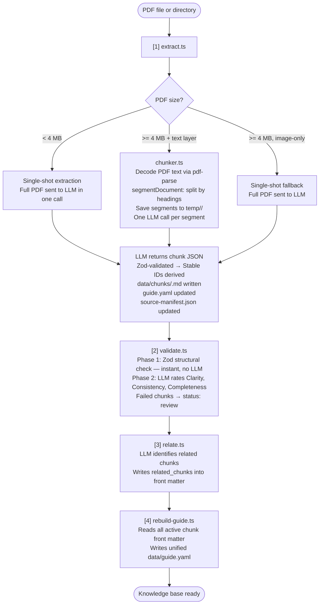

# HWL Troubleshooting Assistant — Guide

> An LLM-powered helpdesk assistant that answers support questions **strictly** from a structured, indexed knowledge base built from your own PDF documents. The AI cannot hallucinate — if the answer is not in a chunk, it escalates.

---

## Table of Contents

1. [Prerequisites](#1-prerequisites)
2. [Setup](#2-setup)
3. [How It Works](#3-how-it-works)
4. [Features](#4-features)
5. [Scripts Reference](#5-scripts-reference)
6. [System Flow](#6-system-flow)
7. [API Reference](#7-api-reference)
8. [File Structure](#8-file-structure)

---

## 1. Prerequisites

| Requirement           | Version                                          |
| --------------------- | ------------------------------------------------ |
| [Bun](https://bun.sh) | `>= 1.0`                                         |
| LLM API Key           | Azure OpenAI / Google Gemini / Groq              |
| PDF documents         | Your source knowledge (user manuals, FAQs, SOPs) |

---

## 2. Setup

```bash
# 1. Copy the environment file
cp .env.example .env

# 2. Fill in your API credentials in .env
#    Set AI_PROVIDER to: azure | google | groq
#    Add the matching API key(s)

# 3. Install dependencies
bun install

# 4. Ingest your first PDF into the knowledge base
bun run ingest ./your-manual.pdf

# 5. Start the API server
bun run server
# → Server running at http://localhost:3000

# 6. (Optional) Test via terminal chat
bun run chat
```

### Environment Variables

| Variable                       | Description                                   |
| ------------------------------ | --------------------------------------------- |
| `AI_PROVIDER`                  | Active provider: `azure`, `google`, or `groq` |
| `AZURE_API_KEY`                | Azure OpenAI API key                          |
| `AZURE_OPENAI_ENDPOINT`        | Azure endpoint URL                            |
| `AZURE_OPENAI_DEPLOYMENT_NAME` | Model deployment name (e.g. `gpt-4o`)         |
| `AZURE_OPENAI_RESOURCE_NAME`   | Azure resource name                           |
| `AZURE_API_VERSION`            | API version (e.g. `2024-12-01-preview`)       |
| `GOOGLE_GENERATIVE_AI_API_KEY` | Google Gemini API key                         |
| `GROQ_API_KEY`                 | Groq API key                                  |

---

## 3. How It Works

The system operates in two distinct phases:

### Phase 1 — Offline Ingestion (you run this manually)

You feed it PDF documents. The extraction strategy is chosen automatically based on file size:

| Condition                                  | Strategy                                                             |
| ------------------------------------------ | -------------------------------------------------------------------- |
| PDF **< 4 MB**                             | Full PDF sent to the LLM in a **single call**                        |
| PDF **≥ 4 MB** with a text layer           | Segmented by headings via the chunker — **one LLM call per segment** |
| PDF **≥ 4 MB**, image-only (no text layer) | Single-shot fallback — full PDF sent to LLM                          |

After extraction, the pipeline:

1. Quality-validates every extracted chunk (structure + LLM clarity gates)
2. Links related chunks together for better retrieval
3. Builds a central `guide.yaml` index used at query time

**Output:** Individual `.md` chunk files in `data/chunks/` + a unified `data/guide.yaml` index.

### Phase 2 — Online Chat (the running server)

When a user asks a question:

1. **Retrieval** — The guide index is sent to the LLM which selects 2–3 relevant chunk IDs
2. **Generation** — Those chunk files are loaded and passed as context; the LLM generates a typed JSON response
3. **Response** — A structured UI-ready envelope is returned with the answer and source citations

**The golden rule:** The AI only reads the knowledge base chunks — it cannot use general world knowledge to answer.

---

## 4. Features

### Knowledge Base Management

- **PDF Ingestion** — Ingest one file, multiple files, or an entire directory in one command
- **Document Type Support** — Standard procedure PDFs and FAQ/Q&A PDFs (via `--type=qna` flag) are handled with separate, tailored prompts
- **Smart Extraction Strategy** — PDFs under 4 MB are sent to the LLM in a single call. Larger PDFs with a text layer are segmented by headings (via `chunker.ts`) with one LLM call per segment. Chunk IDs are always deterministic — derived from a content hash, not from the LLM
- **Source Manifest Tracking** — Every chunk is traced back to its originating PDF via `source-manifest.json`

### Quality & Validation

- **Two-Phase Validation** — Phase 1 is an instant Zod schema check (no LLM cost); Phase 2 is an LLM quality gate scoring Clarity, Consistency, and Completeness
- **Chunk Lifecycle** — Chunks can be `active`, `review` (failed validation), or `deprecated`. Only `active` chunks are used in retrieval
- **E2E Structural Tests** — 170+ instant checks verify that `guide.yaml` and `data/chunks/` are perfectly in sync (no LLM, runs in seconds)
- **Retrieval Accuracy Scoring** — Run a gold-standard test set against the retrieval engine to get a percentage accuracy score

### Chat & API

- **Typed Response Envelopes** — The API never returns free text. Responses are one of 8 strict typed formats that a frontend can render directly:

  | Type         | When Used                                        |
  | ------------ | ------------------------------------------------ |
  | `steps`      | Step-by-step processes                           |
  | `choices`    | Disambiguation needed from the user              |
  | `alert`      | An important warning or constraint               |
  | `checklist`  | A list of items to complete                      |
  | `image`      | A screenshot or diagram is referenced            |
  | `escalation` | No reliable answer; hand off to a support ticket |
  | `summary`    | Confirmation a task is complete                  |
  | `text`       | General fallback                                 |

- **Session Management** — Conversation history tracked per `sessionId` with a 30-minute TTL and 20-message cap
- **Source Citations** — Every response includes `contextChunks` (the exact chunk IDs and source files the AI read)
- **Escalation-First Design** — When the knowledge base has no relevant chunk, the bot responds with an escalation type, never an invented answer
- **CLI Debug Mode** — `--debug` flag on the terminal chat shows exactly which chunks were retrieved before the answer is generated

### Developer Tooling

- **Chunk Debug Preview** — Visualise how a PDF is being segmented before running extraction (no LLM cost)
- **Performance Reports** — Aggregate timing metrics across ingestion runs
- **Winston Structured Logging** — All pipeline steps emit JSON-structured logs compatible with ELK / logging platforms

---

## 5. Scripts Reference

All commands use `bun run <name>`. Run from the project root.

### Primary Workflows

| Command                            | Description                                                                                      |
| ---------------------------------- | ------------------------------------------------------------------------------------------------ |
| `bun run ingest <path>`            | **Full pipeline.** Runs extract → validate → relate → rebuild in sequence. Use for all new PDFs. |
| `bun run ingest --type=qna <path>` | Same as above but uses the FAQ/Q&A extraction prompt instead of the standard procedure prompt.   |
| `bun run server`                   | Starts the HTTP API on `localhost:3000`.                                                         |
| `bun run chat`                     | Interactive terminal chat. No server required.                                                   |
| `bun run chat --debug`             | Terminal chat with evidence box — prints which chunks the AI retrieved before answering.         |

### Ingestion Pipeline (Individual Steps)

> Only needed if you want to run ingestion steps separately, instead of using `bun run ingest`.

| Command                             | Step | Description                                                                                                                                                                              |
| ----------------------------------- | ---- | ---------------------------------------------------------------------------------------------------------------------------------------------------------------------------------------- |
| `bun run extract <path>`            | 1/4  | Reads PDF. PDFs < 4 MB go directly to the LLM in one call. PDFs ≥ 4 MB are segmented by headings first (one LLM call per segment). Writes `.md` chunks + updates `source-manifest.json`. |
| `bun run extract --type=qna <path>` | 1/4  | Same strategy as above, but uses the Q&A extraction prompt.                                                                                                                              |
| `bun run validate`                  | 2/4  | Two-phase quality check: Zod structure pass then LLM clarity/completeness scoring.                                                                                                       |
| `bun run relate`                    | 3/4  | LLM pass to populate `related_chunks` fields across the knowledge base.                                                                                                                  |
| `bun run rebuild`                   | 4/4  | Regenerates `guide.yaml` from all active chunk front-matter. Run after any manual chunk edits.                                                                                           |

### Testing & Evaluation

| Command                  | Description                                                                                                                       |
| ------------------------ | --------------------------------------------------------------------------------------------------------------------------------- |
| `bun run e2e-test`       | 170+ structural integrity checks. Verifies `guide.yaml` ↔ `data/chunks/` alignment, schema, and required sections. Zero LLM cost. |
| `bun run score`          | Runs retrieval accuracy evaluation against `data/test-queries.json`. Outputs a percentage score.                                  |
| `bun run validate-guide` | Fast Zod-only structural check on `guide.yaml` alone.                                                                             |

### Utilities & Maintenance

| Command                     | Description                                                                                                       |
| --------------------------- | ----------------------------------------------------------------------------------------------------------------- |
| `bun run chunk <pdf>`       | Debug tool. Segments a PDF and saves each block as a `.txt` file to `data/debug-chunks/` without calling the LLM. |
| `bun run perf-report`       | Aggregates timing metrics from historical ingestion runs in `data/reports/`.                                      |
| `bun run delete <chunk_id>` | Removes a chunk's `.md` file and strips it from `guide.yaml`.                                                     |

---

## 6. System Flow

### Offline — Ingestion Pipeline



### Online — Chat API Flow


### Input Directories for Ingestion

Place source PDFs in the appropriate folder under `docs/` before running `bun run ingest`:

| Folder            | Document Type                          |
| ----------------- | -------------------------------------- |
| `docs/procedure/` | Step-by-step user manuals and SOPs     |
| `docs/qna/`       | FAQ sheets and Q&A format documents    |
| `docs/chat/`      | Chat log or conversation data (future) |

---

## 7. API Reference

### `GET /api/health`

Returns server status and the current number of active chunks in the knowledge base.

```json
{ "status": "ok", "activeChunks": 21 }
```

### `GET /api/chunks`

Returns a list of all chunks from `guide.yaml`.

### `POST /api/chat`

Main question-answering endpoint.

**Request:**

```json
{
  "message": "How do I submit a timecard?",
  "sessionId": "user-abc-123",
  "mode": "answer"
}
```

| Field       | Required | Description                                                      |
| ----------- | -------- | ---------------------------------------------------------------- |
| `message`   | ✅       | The user's question                                              |
| `sessionId` | ✅       | Unique session identifier for conversation history               |
| `mode`      | ❌       | `answer` (default) or `clarify` (prefers disambiguation choices) |

**Response:**

```json
{
  "response": {
    "type": "steps",
    "data": {
      "title": "How to Submit a Timecard",
      "steps": ["Step 1: ...", "Step 2: ..."]
    }
  },
  "contextChunks": [
    {
      "chunk_id": "timecard-invoices-process",
      "topic": "Timecard Submission",
      "file": "HWL Agency Manual.pdf"
    }
  ]
}
```

**Test with curl:**

```bash
curl -X POST http://localhost:3000/api/chat \
  -H "Content-Type: application/json" \
  -d '{"message": "How do I reset my password?", "sessionId": "test-1"}'
```

---

## 8. File Structure

```
hwl-chat-poc/
│
├── data/
│   ├── guide.yaml              ← Central retrieval index (auto-generated)
│   ├── chunks/                 ← One .md file per knowledge chunk
│   ├── test-queries.json       ← Gold-standard test set for accuracy scoring
│   ├── logs/requests.ndjson   ← Per-request structured logs
│   └── reports/               ← Ingestion performance reports
│
├── docs/
│   ├── procedure/              ← Drop procedure PDFs here
│   ├── qna/                   ← Drop FAQ PDFs here
│   └── chat/                  ← Chat logs (future use)
│
├── src/
│   ├── server.ts              ← Hono HTTP API (port 3000)
│   ├── main.ts                ← Interactive CLI chat
│   ├── extract.ts             ← PDF → chunk extraction orchestrator
│   ├── llm-client.ts          ← All LLM calls (retrieval + generation)
│   ├── chunker.ts             ← Deterministic PDF segmentation engine
│   ├── schemas.ts             ← Zod schemas for chunks, guide, responses
│   ├── providers.ts           ← LLM provider registry (Azure/Google/Groq)
│   ├── config.ts              ← Centralised pipeline configuration
│   │
│   ├── prompts/
│   │   ├── extraction.md      ← System prompt for procedure PDF extraction
│   │   ├── qna-extraction.md  ← System prompt for FAQ/Q&A PDF extraction
│   │   └── chat.md            ← System prompt for answer generation
│   │
│   └── scripts/
│       ├── ingest.ts          ← Full pipeline orchestrator
│       ├── validate.ts        ← Two-phase chunk quality validation
│       ├── relate.ts          ← Related chunk graph generation
│       ├── rebuild-guide.ts   ← guide.yaml regeneration
│       ├── validate-guide.ts  ← guide.yaml structural check
│       ├── eval-retrieval.ts  ← Retrieval accuracy scoring
│       ├── e2e-test.ts        ← Structural regression tests
│       ├── chunk-debug.ts     ← PDF segmentation preview tool
│       ├── perf-report.ts     ← Ingestion performance analytics
│       ├── source-manifest.ts ← PDF → chunk provenance tracking
│       └── delete.ts          ← Safe chunk removal
│
├── source-manifest.json        ← Maps PDFs to the chunk IDs they produced
├── .env.example               ← Copy to .env and fill in your API keys
├── package.json               ← All runnable scripts
├── README.md                  ← Quick start (one page)
├── GUIDE.md                   ← This file
├── HELP.md                    ← Deep-dive technical documentation
├── scripts.md                 ← Scripts quick reference
└── flow.md                    ← Pipeline architecture diagram
```

---

> **Further Reading**
>
> - `HELP.md` — Deep technical documentation with full expected outputs for every command
> - `scripts.md` — Compact scripts quick-reference card
> - `flow.md` — Step-by-step pipeline architecture with LLM call counts
